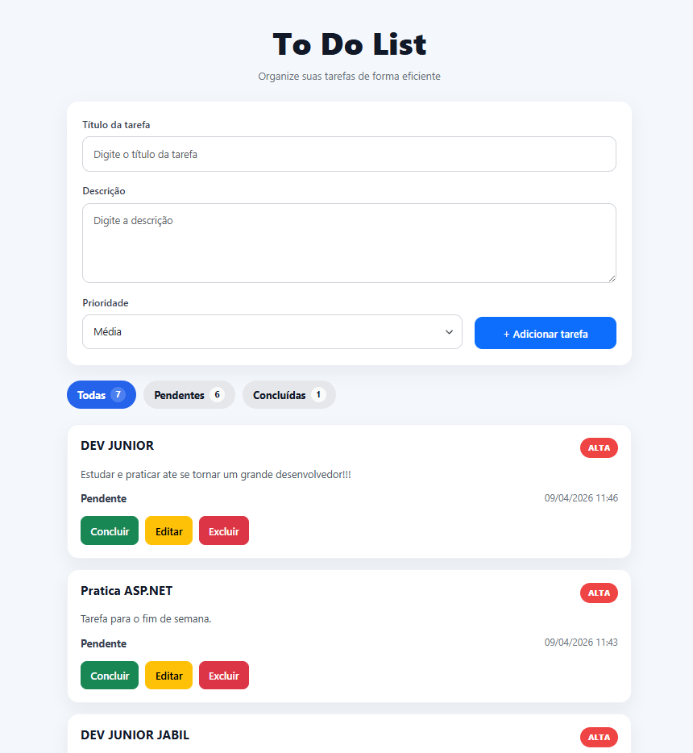

# Technical Test – Junior Developer

Este repositório contém a solução desenvolvida para o teste técnico de Desenvolvedor Júnior, composta por duas partes independentes:

- Sistema de gerenciamento de tarefas - To do List
- Integração com APIs externas utilizando Node-RED

O projeto foi organizado seguindo a estrutura solicitada no teste, com separação entre front-end, back-end, banco de dados e fluxos do Node-RED.

## Estrutura do projeto

TesteTecnico/
│
├── backend/
│   └── backendTodo/
│
├── frontend/
│
├── database/
│   └── script.sql
│
├── node-red/
│   └── flows.json
│
└── README.md

## Tecnologias utilizadas

# Front-end

Angular
TypeScript
HTML
CSS
Bootstrap

# Back-end

C#
ASP.NET Core
Entity Framework Core

# Banco de dados
PostgreSQL
Integração externa

A API também conta com documentação via Swagger para facilitar os testes dos endpoints.
Porta de acesso ao swagger: http://localhost:5295/swagger

[Swagger](./screenshots/swagger.png.png)

## Rotas da API:

Método	Rota	Descrição
GET	/api/task	Lista todas as tarefas
GET	/api/task/{id}	Busca uma tarefa por ID
POST	/api/task	Cria uma nova tarefa
PUT	/api/task/{id}	Atualiza uma tarefa existente
DELETE	/api/task/{id}	Remove uma tarefa
PUT	/api/task/{id}/complete	Marca a tarefa como concluída

## Formulário de criação de tarefa

[Tarefa](./screenshots/newtask.png.png)

Nesta seção, o usuário pode informar:

título da tarefa
descrição
prioridade

Após isso, basta clicar em Adicionar tarefa.

[TarefaConcluir](./screenshots/task.png.png)

## Para este teste, a escolha foi manter a solução mais direta e objetiva, priorizando:

simplicidade
clareza
legibilidade
foco nos requisitos solicitados
Por que não foram utilizados DTOs e camada de Service?

Neste projeto, a estrutura foi mantida propositalmente mais enxuta por se tratar de um CRUD pequeno e com regras simples.

A utilização de DTOs e uma camada de Service poderia adicionar mais complexidade estrutural do que benefício real para este contexto.

Como a aplicação possui:

apenas uma entidade principal
operações diretas de CRUD
regras de negócio simples

a implementação foi mantida de forma objetiva, com menor nível de abstração.

Em um projeto maior, com múltiplas entidades e regras mais complexas, DTOs e Services seriam recomendados para melhorar separação de responsabilidades e manutenção.

## Node-RED

A parte do Node-RED foi feita separadamente do sistema To Do List, conforme solicitado no teste.

Os fluxos implementados realizam:

Broker Catalog

Consulta a API de corretoras da BrasilAPI e exibe as informações em página web.

Zip Code Searcher

Permite pesquisar um CEP e exibir:

rua
bairro
cidade
estado

Também foi feito tratamento para entradas inválidas e CEP não encontrado.

Rotas utilizadas no Node-RED:

/cep
/cep/search
/corretoras

## Como executar o projeto
Pré-requisitos

Antes de executar, é necessário ter instalado na máquina:

.NET SDK
Node.js
Angular CLI
PostgreSQL
Node-RED
Instalar Angular CLI
npm install -g @angular/cli
Instalar Node-RED
npm install -g --unsafe-perm node-red
Executando o back-end

Partindo da pasta raiz do projeto:

cd backend
cd backendTodo
dotnet run

O servidor da API será iniciado localmente.

Normalmente o Swagger ficará disponível em uma URL parecida com:

http://localhost:5295/swagger

dependendo da configuração local.

## Executando o front-end

Volte para a raiz do projeto e rode:

cd frontend
npm install
ng serve

Depois disso, o front-end ficará disponível em:

http://localhost:4200

## Executando o Node-RED

Com o Node-RED instalado:

node-red

Depois, abra no navegador:

http://localhost:1880
http://localhost:1880/cep
http://localhost:1880/corretoras

Importe o arquivo:

/node-red/flows.json

Depois é só fazer o deploy do fluxo.

Autor

Giovane Rodrigues 

31-992568138
